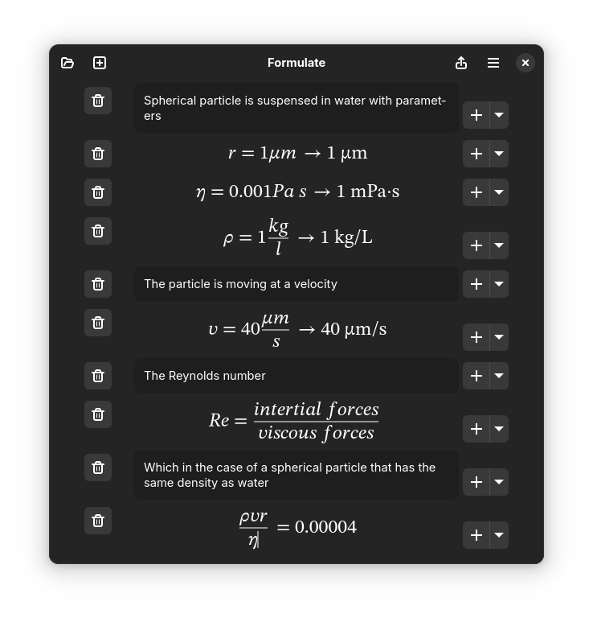

# Formulate

A calculator for solving problems.

## ! Experimental notice !
Formulate is still experimental and under development. This means that crashes and bugs will likely occur and there is no guarantees on file backwards compatability! You can lose your work!

## What?
Formulate combines the fantastic formula editor from [Plots](https://github.com/alexhuntley/Plots) to the powerful calculator [Calculate](https://qalculate.github.io/) in a notebook style interface. It's a calculator that aims to get out of the way and let the user focus on thinking. 

### Goals
 - Unify the process of thinking, typesetting and calculating as much as possible.
 - Encourage documenting why a calculation in the process of solving a problem was done
 - Enable sharing of calculations in some standard format like pdf with pretty enough typesetting

### Non-goals
 - Complex and intensive calculations; These are already served by tools such as Maxima or Juypyter notebooks
 - Customizable typesetting of documents; LaTeX and TeXMacs already do this well

## Installing
For now Formulate is released as a flatpak on the releases page. Formulate is built Linux first, but the flatpak should also work under WSL in windows. 

## Building
Formulate can be built using Flatpak and Gnome Builder. 
